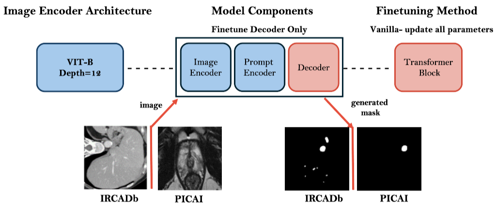

**Introduction**

This repository contains the code for our project: **Optimized Prompting in SAM for Few-Shot and Weakly Supervised Segmentation of Complex Structures and Small Lesions**. In this project, we fine-tune the decoder part of the SAM (Segment Anything Model) using the Vanilla method, where all parameters are updated during training, as depicted in Figure 1. 



**Repository Structure**

**1. 'main.py'**

 **Purpose:**

This is the main script where the SAM model is defined and the training process is executed. The 'SAMDataset' function, which is critical for loading and preprocessing the dataset, is included here.
 
**Key Points:**

- Handles the setup for training and evaluation of the SAM model.
- Includes the function 'SAMDataset', which you need to configure for your specific dataset.
- Handles the prompts you wish to use: these prompts are provided as inputs to the model. If there are prompts you do not want to use, you should set them to `None`.
  
```python
  outputs = model(pixel_values=batch["pixel_values"].to(device),
                  input_boxes=batch["input_boxes"].to(device),# Use this prompt
                  input_points=None,# Other prompts set to None
                  input_labels=None, # Other prompts set to None
                  multimask_output=False)  # set to 'True' if you want multi-mask output
``` 
**Note:** 'input_points' and 'input_labels' prompts should be used together 

**1. 'dataset.py':** 

 **Purpose:**

This file provides a template for setting up your dataset, including necessary transformations and preprocessing steps tailored to your data. 
You don't need to run the 'dataset.py' file directly; the 'SAMDataset' function is invoked within the 'main.py' file during training.

**Key Focus Areas:**

- 'ScaleIntensityRanged' Transform:
   - For images: Adjust the 'a_min' and 'a_max' parameters to match the intensity range of your dataset.
     
   - For labels: Set the 'a_min' and 'a_max' parameters according to the intensity range of your labels.
     If your labels are already binarized (values of 0 and 1), you can skip this transformation for labels.
    
-  Handling of Prompts Functions.

**Note:** For detailed guidance on setting up your own dataset and configuring the prompts functions, please refer to the **'README.md'** file located in the **'preprocessing'** folder.
